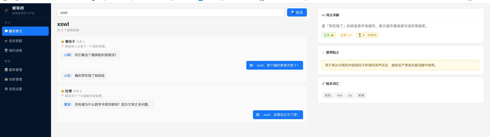
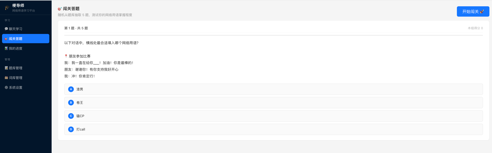
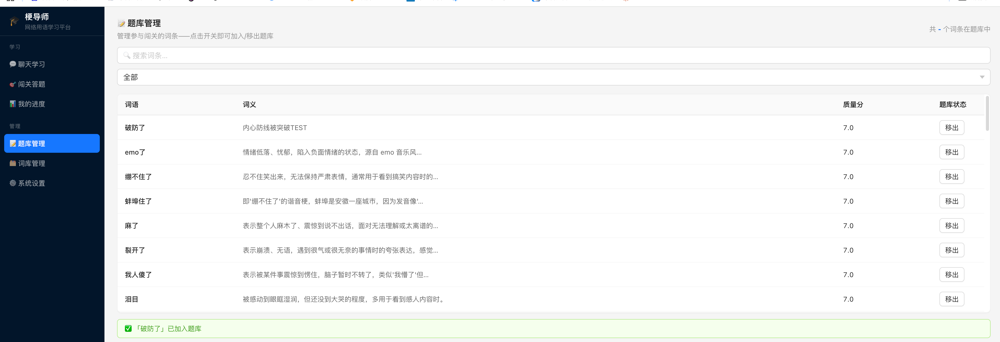
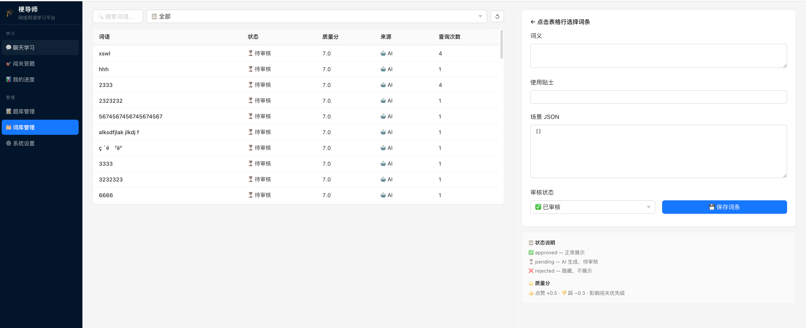

# 网络用语智能学习平台

一个面向中文互联网语境的网络用语学习项目，帮助用户快速理解网络热词的含义、情绪色彩、适用场景和相关表达。项目提供本地词库检索、AI 生成补充、主题闯关、学习进度统计和知识库管理能力，适合作为课程作业、智能体应用原型或 AI+教育类项目展示。

## 项目介绍

本项目围绕“查词 + 学习 + 练习 + 管理”设计，核心目标是把抽象、碎片化的网络用语解释，转换成更容易理解的结构化学习体验。

用户可以在聊天学习页输入例如“破防了”“内卷”“YYDS”“塌房”等网络用语，系统会优先从内置词库中检索词条；如果本地没有对应解释，则可以在配置好 DeepSeek API 后，调用大模型生成结构化解释、使用场景和相关词，并自动写入本地知识库等待审核。

项目默认内置约 50 条常见网络用语数据，首次启动时会自动导入到本地 SQLite 数据库中。

## 主要功能

- 聊天学习：输入网络用语，查看含义、情绪色彩、对话场景、使用贴士和相关词
- AI 增强：本地词库未命中时，可调用 DeepSeek 自动生成结构化词条
- 质量反思：对 AI 生成内容进行评分，低于阈值时可触发重新生成
- 反馈学习：支持点赞/点踩，反馈会影响词条质量分
- 主题闯关：按主题抽题练习，帮助巩固理解
- 学习进度：展示已学词汇、好评率、AI 词条数量和待审核数量
- 知识库管理：支持搜索、筛选、编辑和审核词条
- 系统设置：可在界面中配置 API Key、模型名称和质量阈值

## 技术方案

- 前端界面：`FastAPI` + `Jinja2` 模板
- 智能体编排：`LangGraph`
- LLM 调用：`langchain` / `langchain-openai` / `openai`
- 本地存储：`SQLite`
- 模型服务：`DeepSeek API`

项目采用“本地词库优先，AI 生成兜底”的策略：

1. 用户输入网络用语
2. 系统先进行意图识别
3. 优先从 SQLite 词库中做精确检索和模糊检索
4. 未命中时，在已配置 API Key 的情况下调用 DeepSeek 生成结构化内容
5. 生成结果写入本地数据库，状态默认为 `pending`
6. 管理员可在知识库管理页审核、修改和发布词条

## 项目结构

```text
slang_platform/
├─ agent/
│  ├─ graph.py        # LangGraph 流程编排
│  ├─ prompts.py      # 大模型提示词
│  └─ tools.py        # 检索、渲染、AI 调用、闯关构题
├─ data/
│  └─ slang_dict.json # 内置网络用语词库
├─ db/
│  └─ database.py     # SQLite 初始化与读写
├─ routes/            # FastAPI 路由（页面 + API）
├─ static/            # 静态资源
├─ templates/         # Jinja2 HTML 模板
├─ main.py            # FastAPI 应用入口
├─ config.py          # 配置加载
├─ start.sh           # 一键启动脚本（Mac/Linux）
├─ start.bat          # 一键启动脚本（Windows）
├─ requirements.txt   # Python 依赖
└─ README.md
```

## 运行方式

### 1. 环境要求

- Python 3.10 或更高版本
- Windows / macOS / Linux 均可运行
- 如需 AI 生成功能，需要可用的 DeepSeek API Key

### 2. 一键启动（推荐）

项目提供了启动脚本，会自动创建虚拟环境、安装依赖并运行，**无需手动配置环境**。

**Mac / Linux：**

```bash
bash start.sh
```

**Windows：**

双击运行 `start.bat`，或在命令提示符中执行：

```bat
start.bat
```

首次运行会自动安装依赖，需要几分钟，之后再启动就很快。

### 3. 手动启动（熟悉 Python 的用户）

```bash
pip install -r requirements.txt
python main.py
```

### 4. 访问应用

启动成功后，在浏览器打开：

```text
http://127.0.0.1:8000
```

程序首次运行时会自动完成以下操作：

- 初始化本地 SQLite 数据库 `slang_learning.db`
- 将 `data/slang_dict.json` 中的内置词条导入数据库

## 项目需要什么

### 必需项

- Python 运行环境
- `requirements.txt` 中列出的依赖库

### 可选项

- DeepSeek API Key
- DeepSeek Base URL
- 主生成模型名称
- 反思模型名称

如果不配置 API Key，项目仍然可以运行，但会使用“本地词库 / Mock 模式”：

- 已收录词语可以正常查询
- 未收录词语不会真正调用大模型生成
- 更适合本地演示界面和基础功能

如果配置了 API Key，则可以在系统设置页启用完整 AI 模式。

## 配置说明

项目配置支持两种方式：

### 方式一：界面中配置

启动后进入“系统设置”页面，填写：

- `DEEPSEEK_API_KEY`
- `DEEPSEEK_BASE_URL`
- `MAIN_MODEL`
- `REFLECT_MODEL`
- `QUALITY_THRESHOLD`

保存后会写入项目根目录下的 `settings.json`。

### 方式二：环境变量配置

项目也支持通过环境变量读取配置，主要包括：

- `DEEPSEEK_API_KEY`
- `DEEPSEEK_BASE_URL`

## 页面说明

### 聊天学习

- 输入网络用语后展示解释卡片
- 支持点赞和点踩反馈
- 词条内容包含含义、情绪、场景对话、使用贴士和相关词



### 闯关答题

- 提供职场黑话、恋爱俚语、饭圈用语、情绪表达、日常搞笑等主题
- 每组默认 5 题
- 通过对话场景选择正确网络用语



### 我的进度

- 展示已学词汇数量
- 展示好评率
- 展示最近学习记录
- 展示 AI 词条和待审核词条数量

### 题库管理

- 搜索词条并一键加入/移出题库
- 展示词义摘要和质量分



### 词库管理

- 可搜索和筛选词条
- 可编辑释义、使用贴士和场景 JSON
- 可设置审核状态：`approved`、`pending`、`rejected`



### 系统设置

- 配置 DeepSeek 接口信息
- 切换生成模型和反思模型
- 调整 AI 内容质量阈值

## 数据与存储

项目主要使用两个本地数据源：

- `data/slang_dict.json`：内置初始词库
- `slang_learning.db`：运行时生成的 SQLite 数据库

数据库中主要包含三类信息：

- `words`：词条主表
- `user_memory`：学习记录与反馈
- `challenge_progress`：闯关进度

## 适用场景

- 智能体课程设计或毕业设计
- AI 教育类项目原型展示
- 中文网络文化学习工具
- Gradio + LangGraph + SQLite 的综合练习项目

## 后续可扩展方向

- 增加更多网络用语和主题分类
- 接入更完整的用户登录与多用户学习记录
- 补充自动化测试和部署方案
- 增加词条审核工作流与权限控制
- 支持导出学习报告或错题本

## 快速开始总结

如果你只是想先跑起来：

- **Mac / Linux**：终端执行 `bash start.sh`
- **Windows**：双击 `start.bat`

等脚本完成后，浏览器访问 `http://127.0.0.1:8000` 即可。

如果你希望启用 AI 生成能力，再到”系统设置”页填写 DeepSeek API 配置即可。
